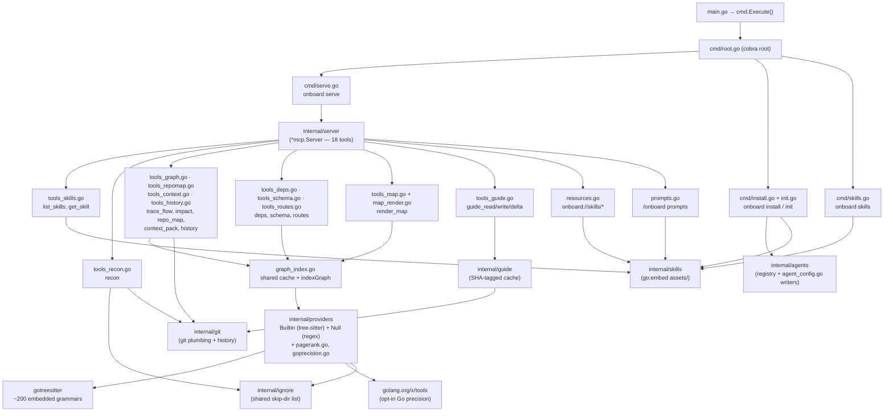

# Architecture

You're now past the user docs and into the engine room — this is for people who want to
*change* onboard, not just run it. (Want the gentle mental model instead? That's
[concepts.md](concepts.md). This doc assumes you've read it.)

`onboard` is a single Go binary with two personalities that share one codebase:

1. **An MCP server** (`onboard serve`) — what AI agents launch. It exposes skills,
   a code-intelligence engine, and a durable guide cache as MCP tools, resources, and
   a prompt.
2. **A CLI installer** (`onboard install` / `init` / `doctor` / `skills`) — what a human
   runs to wire the binary into their agents and verify it took.

Both personalities are served from the same `//go:embed`'d assets, so there is exactly
one source of truth for skill content regardless of how it is consumed.

## Design principles

Almost every implementation decision follows from a small set of constraints. Knowing
them makes the rest of the code predictable.

1. **One static, CGo-free, cross-compilable binary.** This is the north star. It is why
   the call-graph engine uses a *pure-Go* tree-sitter reimplementation
   ([`gotreesitter`](https://github.com/odvcencio/gotreesitter)) instead of the more
   mature CGo bindings, why ~200 language grammars are embedded into the binary, and why
   any toolchain-dependent precision layer (e.g. `go/packages` or `rust-analyzer`) is kept
   optional and behind a runtime capability check — never a hard dependency. `CGO_ENABLED=0` builds
   for darwin/linux/windows × amd64/arm64 from one runner.

2. **Honesty over false precision.** By default the call graph is built from *syntactic*
   tree-sitter tags resolved by name + lexical scope — not type-checked. The code says so
   out loud: edges are presented as "likely, not proven," ambiguous names are left
   **unresolved rather than guessed** (guessing would manufacture false edges,
   `internal/providers/builtin.go`), and every `impact` result carries a caveat `Note`.
   The exceptions are opt-in: for a Go module with the `go` toolchain present, `precise`
   enriches the graph with type-checked edges (`internal/providers/goprecision.go`); for a
   Rust Cargo project with `rust-analyzer` present, it enriches through LSP call hierarchy
   (`internal/providers/rustprecision.go`). The note upgrades from "likely" to semantic
   caveats for those edges (`edgeCaveat`, `internal/server/graph_index.go`).

3. **Graceful degradation, not hard failure.** Missing a git repo, an unsupported
   language, or a thin graph yields a populated `Note` field and a still-useful result,
   not an error. When the tree-sitter provider matches zero files, the server falls back
   to a regex-only `Null` provider that still lists definitions
   (`internal/server/graph_index.go`).

4. **Single source of truth via `//go:embed`.** Skills live once under
   `internal/skills/assets/`. The same embed feeds the MCP surface (tools/resources/
   prompt) and the per-agent installer, so the server and every installed agent always
   agree.

5. **Never silently clobber a user's config.** The installer merges into existing agent
   configs, is idempotent when current (re-running reports `already-present`), refreshes
   stale onboard command paths when the binary moved, preserves file permissions and TOML
   comments, and backs up any config it cannot parse to `<path>.onboard-bak`
   (`internal/agents/agent_config.go`).

## Component map



## Package layout

| Package | Role |
|---------|------|
| `main.go` | Entry point; calls `cmd.Execute()`. |
| `cmd/` | Cobra CLI: `root`, `serve`, `install`, `uninstall`, `init`, `doctor`, `skills`. Holds the `-ldflags`-stamped `version`/`commit`/`date` vars. |
| `internal/server/` | The MCP server. `server.go` constructs `*mcp.Server` and registers all 18 tools; `tools_*.go` implement them; `graph_index.go` holds the shared per-root graph cache (`indexGraph`); `sqlddl.go` and `manifests.go` are the parsers behind `schema`/`deps`; `map_render.go` is `render_map`'s Mermaid/HTML rendering; `resources.go`/`prompts.go` add the resource and prompt surfaces. |
| `internal/skills/` | Embedded skill bundles (`//go:embed assets`) and a deliberately naive frontmatter parser. |
| `internal/providers/` | The code-graph engine: the `Provider` interface, the `Builtin` tree-sitter provider, the `Null` regex fallback, the `Graph`/`Symbol` model with name+scope resolution, PageRank ranking (`pagerank.go`), and opt-in semantic precision layers for Go (`goprecision.go`) and Rust (`rustprecision.go`). |
| `internal/guide/` | The durable, SHA-tagged guide cache: path resolution, header format, read/write. |
| `internal/git/` | Thin wrappers over the `git` CLI: availability, common-dir, HEAD SHA, branch, `diff --name-status`, and per-file churn/ownership history. |
| `internal/agents/` | The installer: the agent registry/detection (`agents.go`) and the never-clobber JSON/TOML MCP-config writers (`agent_config.go`), for eight agents. |
| `internal/ignore/` | Single source of truth for the dependency/build directories that code-walking tools skip. |
| `docs/` | This documentation. |

## The MCP surface — three ways to reach a skill

Different MCP clients support different parts of the protocol, so the same skill content
is exposed three ways (`internal/server/server.go`):

| Surface | Mechanism | Reaches |
|---------|-----------|---------|
| `list_skills` / `get_skill` | MCP **tools** | every client (tools are universal) |
| `onboard://skills/<name>` | MCP **resources** | clients that read resources |
| `/onboard`, `/onboard-skills` | MCP **prompts** | clients that surface prompts |

The `/onboard` prompt and the `onboard://skills/onboard-codebase-walkthrough` resource
both return the same rendered `onboard-codebase-walkthrough` content; the prompt wraps it
as a user-role message so a client drops straight into the walkthrough workflow.
`/onboard-skills` is the catalog prompt for discovering the rest of the suite.

## Request lifecycle (server mode)

1. A human runs `onboard install --agent claude` (or `onboard init`). The installer
   writes the skill files into the agent's skills dir and adds an `onboard` MCP server
   entry to the agent's config, pointing at the absolute binary path with `args:
   ["serve"]`.
2. The agent launches `onboard serve`. By default this speaks MCP over **stdio**
   (`internal/server` via `&mcp.StdioTransport{}`, `cmd/serve.go`). With `--http
   `127.0.0.1:8080` it instead serves **Streamable HTTP** at `/mcp` (`cmd/serve.go`) for
   hosted or CI use.
3. The agent calls tools. Read-only structural tools (`recon`, `trace_flow`, `impact`,
   `repo_map`, `context_pack`, `history`, `deps`, `schema`, `routes`, `render_map`) analyze
   the repo on demand. The code graph is **cached in memory per repo root** with a
   32-entry / 30-minute bound (`refresh: true` forces a re-index —
   `internal/server/graph_index.go`), and is additionally **persisted to a content-hashed
   on-disk cache** inside `.git` so cold starts re-parse only changed files
   (`internal/providers/cache.go`,
   [code-graph.md](code-graph.md#persistent-incremental-index)).
4. For longitudinal work, the agent persists a `codebase-walkthrough.md` guide via
   `guide_write`, tagged with the current HEAD SHA, and later uses `guide_read` /
   `guide_delta` to reuse or incrementally update it.

## Data flow: a `trace_flow` / `impact` call

```
tool call (entry/symbol, root, depth, refresh)
        │
        ▼
resolveRoot ──► indexGraph(root, refresh)
                     │  cache hit? return cached *Graph
                     │  else: per-root mutex, then…
                     ▼
              providers.Builtin.Index(root)
                 walk files → detect language (gotreesitter)
                 tag each file → definitions + references (calls)
                 compute innermost enclosing definition per reference
                 resolve reference → definition by unique name in file, then globally
                 build Forward (caller→callees) and Reverse (callee→callers) adjacency
                     │  0 files matched? fall back to providers.Null (defs only)
                     ▼
              FindSymbols(entry)  → matched + candidates
                     │
        ┌────────────┴─────────────┐
        ▼                          ▼
 trace_flow: BFS over Forward   impact: DFS over Reverse
 to `depth` (≤250 nodes)        (direct + transitive callers)
        │                          │  intersect callers with test files
        ▼                          ▼
   nodes + callees            direct/transitive callers + at-risk tests + caveat Note
```

See [code-graph.md](code-graph.md) for the full algorithm and accuracy limits.

## Transports

| Transport | When | Wiring |
|-----------|------|--------|
| **stdio** | Default; what interactive agents launch. | `s.Run(ctx, &mcp.StdioTransport{})` — `cmd/serve.go`. |
| **Streamable HTTP** | `onboard serve --http 127.0.0.1:8080`; local headless / CI harnesses. For hosted/shared use, set `--http-token` / `ONBOARD_HTTP_TOKEN` and put it behind TLS and network controls. | `mcp.NewStreamableHTTPHandler` mounted at `/mcp`, served by a `net/http` server with read-header/read/write/idle timeouts, graceful shutdown, a request body cap, optional bearer auth, stderr request logs, and `/metrics` counters — `cmd/serve.go`. Default SDK options: stateful sessions, localhost protection on. |

The *same* `*mcp.Server` (same tools, resources, prompt) runs over both transports; only
the transport differs. Unit tests exercise it over in-memory transports and the HTTP
path over `httptest` (`internal/server/*_test.go`).
