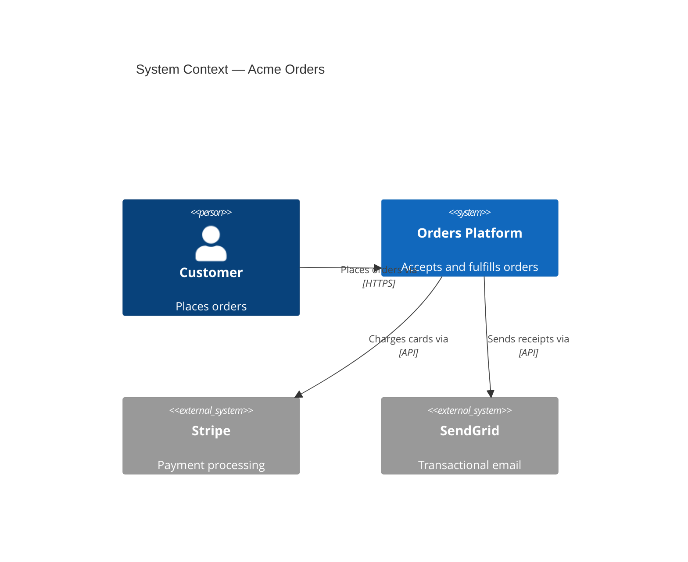
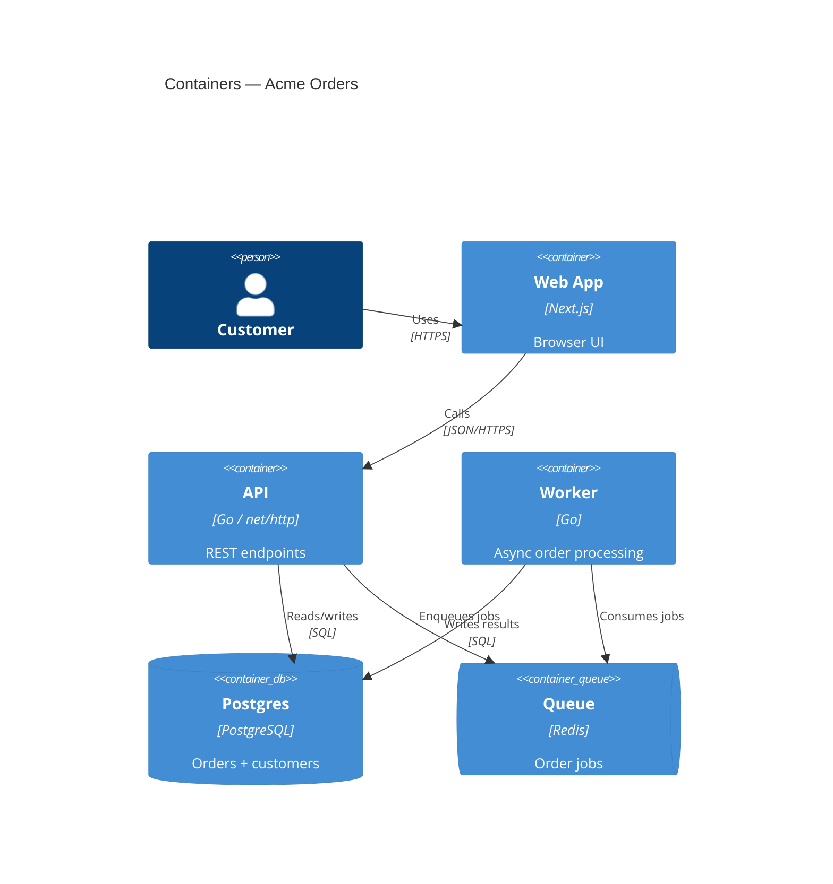
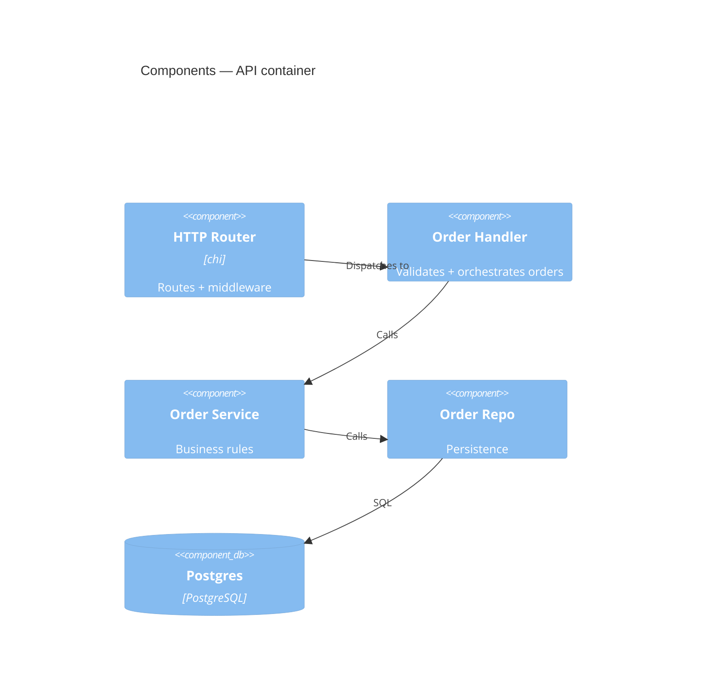
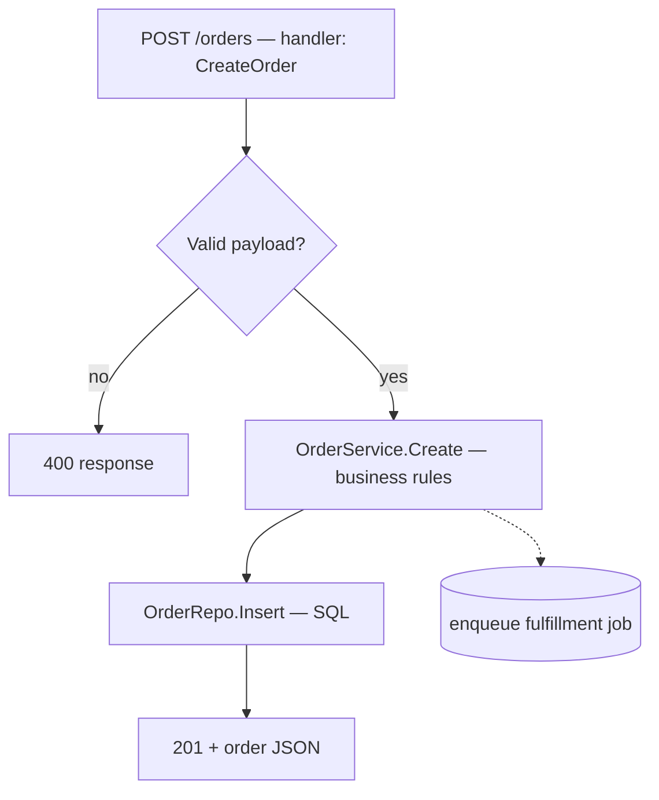
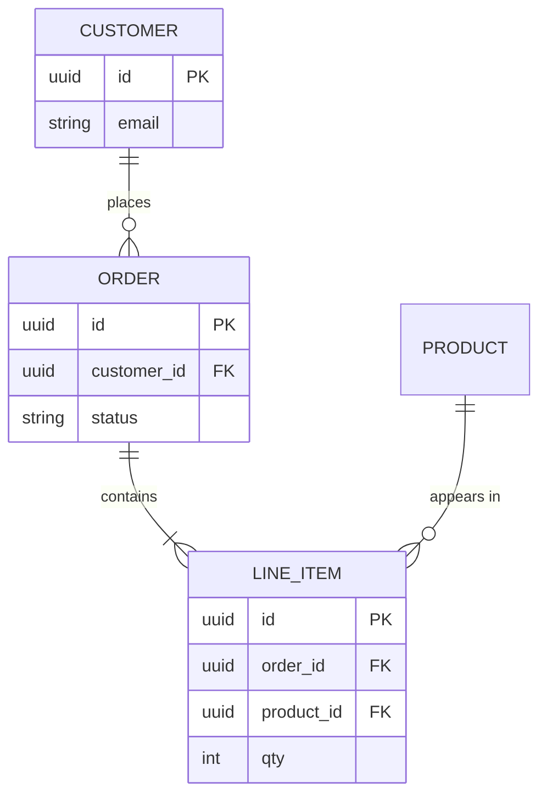
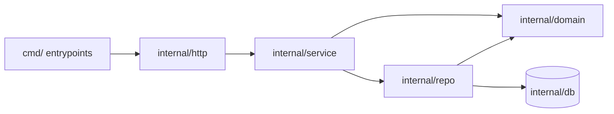

# Diagram Catalog

Syntax skeletons and worked examples for each diagram type this skill draws, plus the altitude decision guide. Pick the type in Step 0 of SKILL.md, copy the matching skeleton, fill it from `onboard:recon` + `onboard:render_map` / `onboard:trace_flow`, then prune to 5–12 nodes.

## Table of contents
- [Altitude to type decision guide](#altitude-to-type-decision-guide)
- [C4 Context](#c4-context)
- [C4 Container](#c4-container)
- [C4 Component](#c4-component)
- [Flowchart — request / job flow](#flowchart--request--job-flow)
- [erDiagram — database schema](#erdiagram--database-schema)
- [Dependency graph — packages / modules](#dependency-graph--packages--modules)
- [Inferred-edge convention](#inferred-edge-convention)

## Altitude to type decision guide

Go as high as the question allows, then drill down only if asked. Draw a *set* of diagrams (context, then container, then a flow) rather than one over-stuffed canvas.

| Question the user is really asking | Type |
|---|---|
| "How does this system fit with its users and other systems?" | C4 Context |
| "What are the deployable pieces and what talks to what?" | C4 Container |
| "What's inside this one service?" | C4 Component (or flowchart) |
| "How does a request / event flow end to end?" | flowchart (or sequenceDiagram) |
| "What does the data model look like?" | erDiagram |
| "Which packages depend on which?" | flowchart (dependency graph) |

## C4 Context

Highest altitude: the system as one box, surrounded by the people and external systems it talks to. One system box + 2–6 actors/externals.

Legend: the single `System` is the whole repo; each `System_Ext` is named from `onboard:recon` framework/SDK fingerprints (a Stripe SDK to a Stripe external; an SMTP/email client to an email external).

## C4 Container

The runnable/deployable pieces of one system: services, databases, queues, frontend, caches. Use recon's `dir_tree` + `frameworks` + `entry_points` to identify them.

Legend maps each `Container` to a directory or service path (e.g. `web` to `web/`, `api` to `cmd/api/`, `worker` to `cmd/worker/`). The `worker -> db` edge is the kind often **inferred** from naming when no static call connects them — mark it dashed if you could not confirm it in the code graph.

## C4 Component

Inside one container: its major components/modules and their relationships. Keep to one container; 5–12 components.

Get these edges from `onboard:trace_flow(entry=...)` starting at the handler, then collapse the callee list into named components. The edges are syntactic — see the inferred-edge convention before treating any as proven.

## Flowchart — request / job flow

One path end to end: entry to validation to logic to persistence to response. Built from `onboard:trace_flow`. Use direction `TD` (top-down) or `LR` (left-right).

Labels name the concept *and* the concrete symbol/file. The `C -.-> Q` dashed edge is inferred (e.g. enqueue happens via an event bus `trace_flow` cannot follow) — see the inferred-edge convention below.

## erDiagram — database schema

Entities, fields, and foreign-key relationships. Transcribe from the model/migration/schema files recon points to; cardinality comes from FKs and join tables, never from guessing.

Cardinality glyphs: `||` exactly one, `o{` zero-or-many, `|{` one-or-many. If a relationship is implied by a column name but has no declared FK, treat it as inferred and note it in the legend.

## Dependency graph — packages / modules

Which package imports which. Fastest path: call `onboard:render_map(topic, format="mermaid", root=...)` with `nodes`/`edges` omitted — it auto-derives this from the code graph. Then prune cross-cutting/util nodes that connect to everything (they add noise) and hold to 5–12.

The auto-derived edges are import-based — steadier than call resolution but still syntactic, so generated or conditionally-loaded imports may be missed. A cycle in this graph is worth surfacing to the user (it usually signals a leaky boundary), but stay descriptive: this skill draws, it does not audit (auditing is onboard-test-gap-and-risk-auditor).

## Inferred-edge convention

The code graph is **syntactic** — matched by name + lexical scope, not type-checked. Dynamic dispatch, interfaces, reflection, DI, and event buses hide real edges and can fake edges between same-named symbols. So:

- **Confirmed** edge (present in `trace_flow` / `render_map` output): solid — `A --> B`.
- **Inferred** edge (you believe it exists but could not confirm it in the graph): dashed — `A -.-> B` — and list it in the legend with one line on *why* you inferred it.

Never present an inferred edge as proven. End the legend with a line like: `Edges: solid = present in code graph; dashed = inferred — [list].`